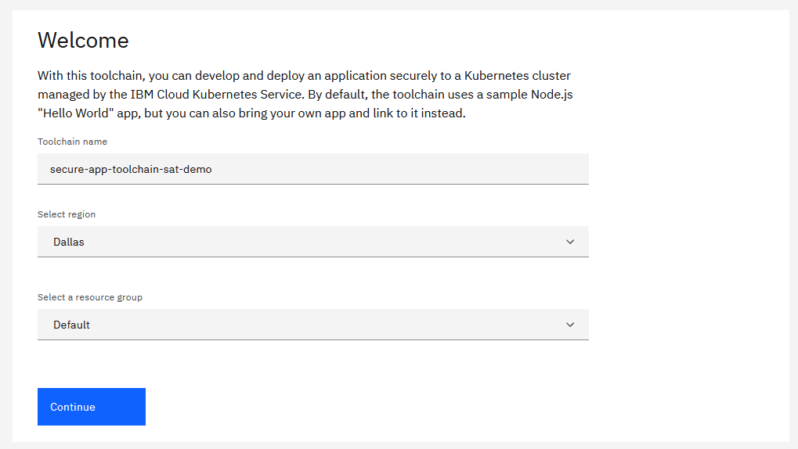
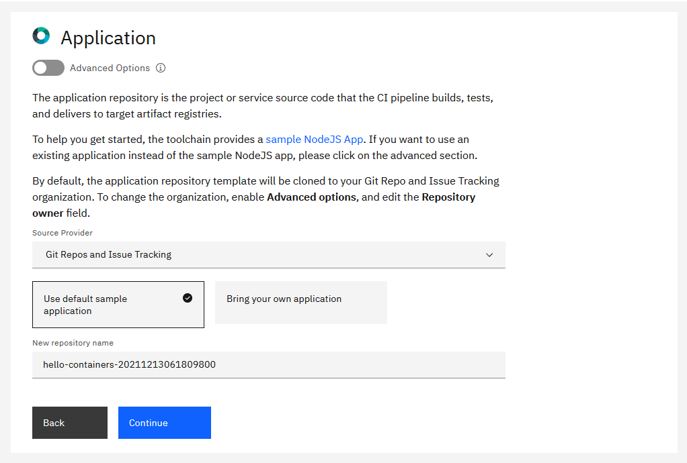
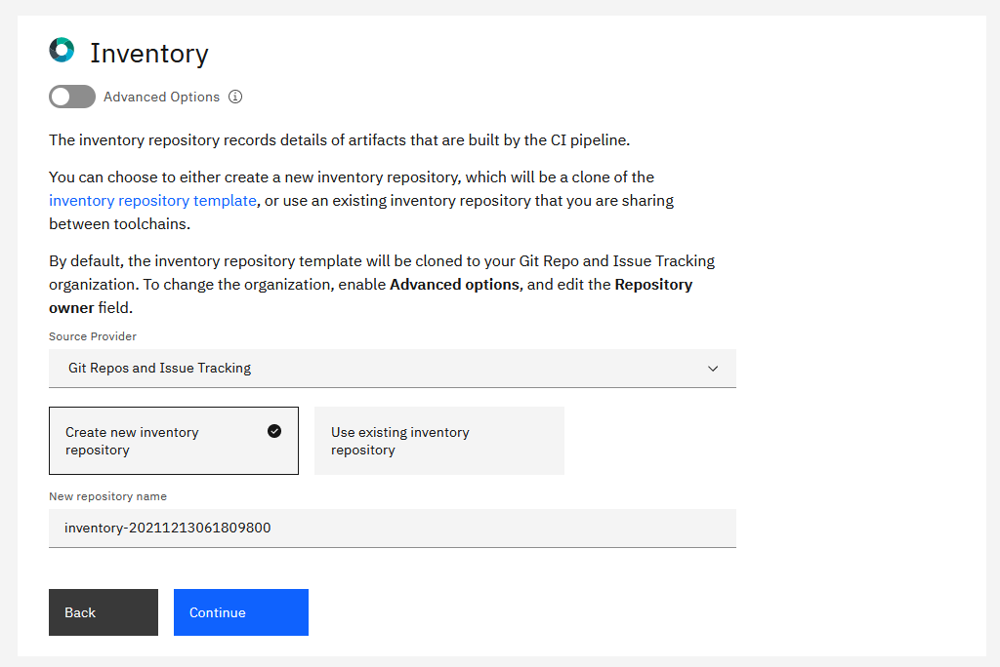
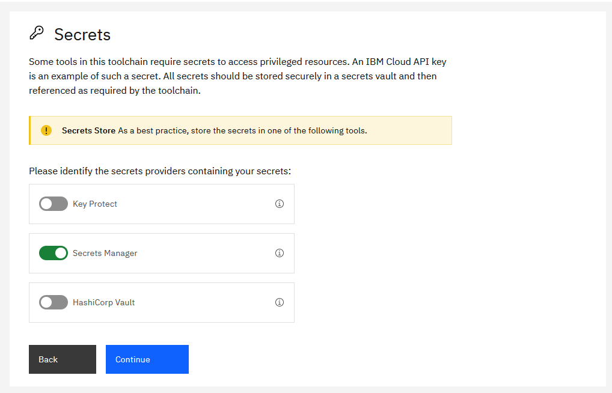
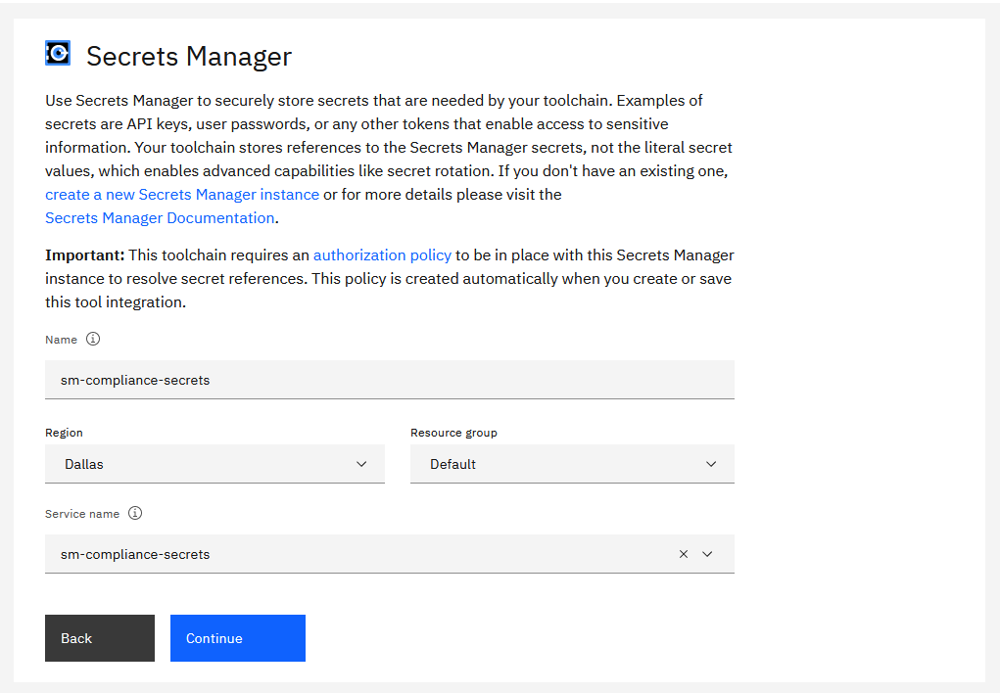
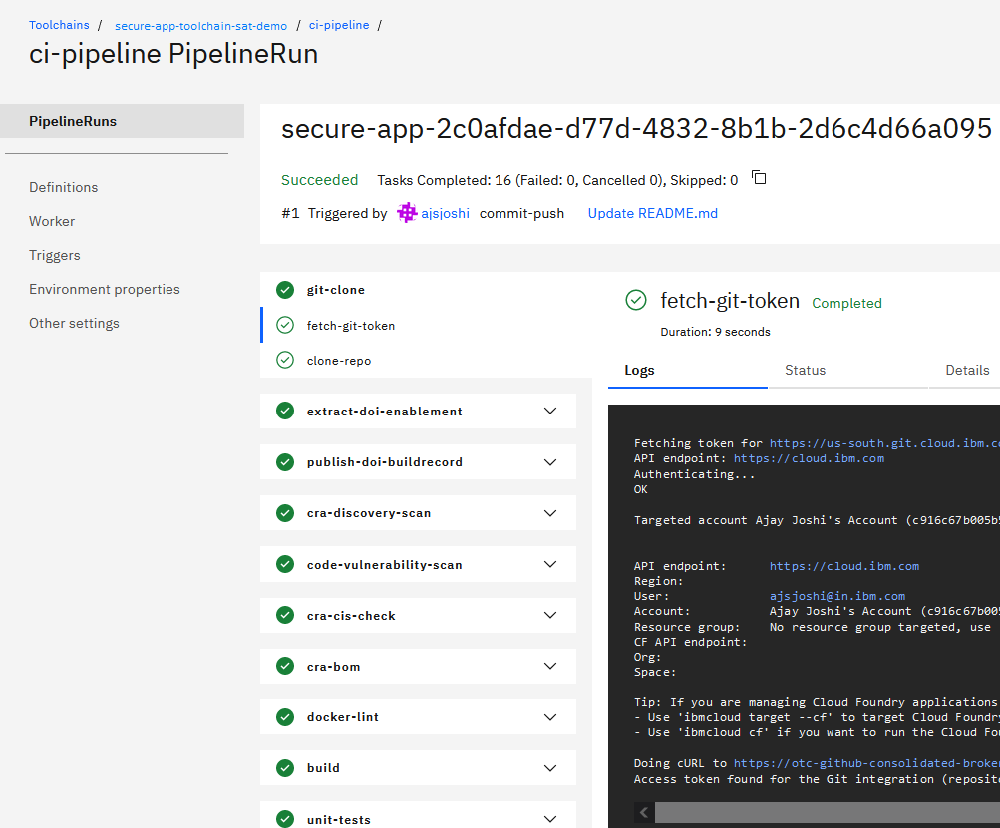
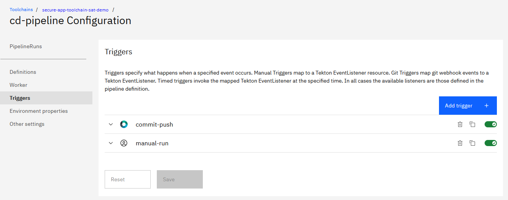

---

copyright:
   years: 2022
lastupdated: "2022-02-24"

keywords: deployment strategies, Satellite, satellite, tekton, pipeline, toolchain, CD, CI, automate, automation, continuous delivery, continuous integration, DevOps, shift-left, shift left, secure DevOps, IBM Cloud

subcollection: ContinuousDelivery

content-type: tutorial
services: satellite, apps, openshift, containers, ContinuousDelivery
account-plan: paid
completion-time: 30m

---

{:step: data-tutorial-type='step'}
{:shortdesc: .shortdesc}
{:table: .aria-labeledby="caption"}
{:screen: .screen}  
{:codeblock: .codeblock}  
{:pre: .pre}
{:tip: .tip}
{:note: .note}
{:important: .important}
{:download: .download}
{:external: target="_blank" .external}


# Develop and deploy an app by using {{site.data.keyword.satellitelong_notm}}
{: #tutorial-cd-satellite}
{: toc-content-type="tutorial"}
{: toc-services="satellite, apps, openshift, containers, ContinuousDelivery"}
{: toc-account-plan="paid"}
{: toc-completion-time="30m"}

In this tutorial, you learn how to create an open toolchain by using {{site.data.keyword.contdelivery_full}} and deploy your app on [{{site.data.keyword.satelliteshort}}](/docs/satellite?topic=getting-started). You also learn how toolchains are implemented in the {{site.data.keyword.contdelivery_short}} service and how to develop and deploy a simple web application (app) by using toolchains.
{: shortdesc}

{{site.data.keyword.satellitelong_notm}} brings public cloud services to any environment, allowing customers with stringent regulatory requirements to use the flexibility and agility of these services for their secure on-premises data center. {{site.data.keyword.contdelivery_short}} uses [{{site.data.keyword.satelliteshort}} Config](/docs/satellite?topic=satellite-cluster-config) to deploy an app across a group of clusters in {{site.data.keyword.satellitelong_notm}}. With {{site.data.keyword.satelliteshort}} Config, you create a configuration to specify which Kubernetes resources you want to deploy to a cluster group of Kubernetes or {{site.data.keyword.openshiftlong}}  clusters that are running in your {{site.data.keyword.satelliteshort}} location or in {{site.data.keyword.cloud_notm}}.

The toolchain that is used in this tutorial implements standard DevOps practices such as code scanning, acceptance tests, Git repos, and continuous integration and continuous delivery capabilities. After you create clusters and associate them with a {{site.data.keyword.contdelivery_short}} cluster group, create a toolchain to change your app's code and push the change to the {{site.data.keyword.gitrepos}} repo. When you push changes to your repo, the Tekton-based delivery pipeline automatically builds and deploys the code.

[Tekton](https://www.ibm.com/cloud/blog/tekton-a-modern-approach-to-continuous-delivery){: external} is an open source, vendor-neutral, Kubernetes-native framework that you can use to build, test, and deploy apps. Tekton provides a set of shared components for building [continuous integration](https://www.ibm.com/garage/method/practices/code/practice_continuous_integration/){: external} and [continuous delivery](https://www.ibm.com/garage/method/practices/deliver/practice_continuous_delivery/){: external} systems. As an open source project, Tekton is managed by the [Continuous Delivery Foundation](https://cd.foundation/){: external}. The goal is to modernize continuous delivery by providing industry specifications for pipelines, workflows, and other building blocks. With Tekton, you can build, test, and deploy across cloud providers or on-premises systems by abstracting the underlying implementation details. Tekton pipelines are built into [{{site.data.keyword.contdelivery_short}}](https://www.ibm.com/cloud/blog/announcements/build-and-deliver-using-tekton-enabled-pipelines){: external}. For more information about the {{site.data.keyword.containerlong}}, see [{{site.data.keyword.containerlong}}](https://www.ibm.com/garage/method/practices/run/tool_ibm_container){: external}.

The template that is used in this tutorial works with the Standard plan for Kubernetes.
{: tip}

## Before you begin
{: #cd-satellite-tutorial-prereqs}

Before you start this tutorial, make sure that you have the following resources in place:

* An [{{site.data.keyword.cloud_notm}} account](https://{DomainName}/registration){: external}. Depending on your {{site.data.keyword.cloud_notm}} account type, access to certain resources might be limited. Depending on your account plan limits, certain capabilities that are required by some of the deployment strategies might not be available. For more information about {{site.data.keyword.cloud_notm}} accounts, see [Setting up your {{site.data.keyword.cloud_notm}} account](/docs/account?topic=account-account-getting-started) and [Upgrading your account](/docs/account?topic=account-upgrading-account).

* A [Kubernetes cluster](/docs/containers?topic=containers-getting-started) and an API key. You can create these resources by using either the UI or the CLI. The cluster might take some time to provision. As the cluster is created, it progresses through the Deploying, Pending, and Ready stages. For more information about Kubernetes clusters, see [Kubernetes clusters](/docs/containers?topic=containers-clusters).

* A [{{site.data.keyword.satelliteshort}} cluster group](/docs/satellite?topic=satellite-setup-clusters-satconfig) that contains the cluster that is required by the toolchain. The toolchain in this tutorial supports a {{site.data.keyword.satelliteshort}} cluster group that contains only one type of cluster: a Kubernetes cluster or a {{site.data.keyword.satelliteshort}} cluster.

* An instance of the [{{site.data.keyword.contdelivery_short}}](/docs/ContinuousDelivery?topic=ContinuousDelivery-getting-started) service.

* **Optional**. Secrets that are stored in a secrets management vault and managed centrally from a single location. For more information about choosing from the various secrets management and data protection offerings, see [Managing {{site.data.keyword.cloud_notm}} secrets](/docs/secrets-manager?topic=secrets-manager-manage-secrets-ibm-cloud). If you don't already have an instance of the secrets management vault provider of your choice, create one.

* **Optional**. A namespace that is created by using the container registry command line. To create a namespace, type the following command from the command line:

   ```text
   ibmcloud cr namespace-add <my namespace>
   ```
   
   Alternatively, you can create a namespace on the [Container Registry](https://cloud.ibm.com/registry/namespaces) page. For more information about creating a namespace in this location, see [IBM Cloud Container Registry](https://cloud.ibm.com/docs/Registry?topic=Registry-getting-started#getting-started) service.
   


### Related content
{: #related-content}
{: step}

* [Getting started with {{site.data.keyword.contdelivery_short}}](/docs/ContinuousDelivery?topic=ContinuousDelivery-getting-started)
* [Getting started with clusters](/docs/containers?topic=containers-getting-started)
* [Getting started with toolchains](https://cloud.ibm.com/devops/getting-started){: external}


## Create the toolchain
{: #cd-satellite-toolchain-create}
{: step}

In this step, you create a **Develop and Deploy application to Kubernetes using deployment strategies** toolchain. The target Kubernetes cluster is configured during the toolchain setup by using your {{site.data.keyword.cloud_notm}} API key and your Kubernetes cluster name. You can change these settings later by updating the {{site.data.keyword.deliverypipeline}} configuration. Any code that is merged into the target Git repo branch is automatically built, validated, and deployed into the Kubernetes cluster.

To create a **Develop and Deploy application to Kubernetes using deployment strategies** toolchain, click

[](https://cloud.ibm.com/devops/setup/deploy?repository=https://github.ibm.com/open-toolchain/secure-app-toolchain&env_id=ibm:yp:us-south){: external}

Alternatively, from the {{site.data.keyword.cloud_notm}} console, click the menu icon , and select **DevOps**. On the **Toolchains** page, click **Create a Toolchain**. On the **Create a Toolchain** page, click **Develop and Deploy application to Kubernetes using deployment strategies**.
{: tip}


### Configure the toolchain name and region
{: #satellite-toolchain-name-region}

Review the default information for the toolchain settings. The toolchain's name identifies it in {{site.data.keyword.cloud_notm}}. Make sure that the toolchain's name is unique within your toolchains for the same region and resource group in {{site.data.keyword.cloud_notm}}.

The toolchain region can differ from the cluster and registry region.
{: tip}

{: caption="Figure 1. Kubernetes secure app toolchain name and region" caption-side="bottom"}

### Select the deployment strategy
{: #satellite-toolchain-select-strategy}

The toolchain creates a Continuous Deployment Pipeline to deploy the application Docker image on the cluster group that is defined in {{site.data.keyword.satelliteshort}}.

1. Click **Multiple clusters via Satellite** to deploy your app by using {{site.data.keyword.satelliteshort}}.

   {: caption="Figure 2. Deployment strategies" caption-side="bottom"}
   
1. Click **Continue**.


### Configure the application source code repo
{: #satellite-tool-integration-application}

In the Application step, the recommended options for the application source code repo are displayed by default. To view all of the available options for the underlying Git integration, click **Advanced Options**. By default, the toolchain uses the default sample that clones the sample app as an IBM-hosted {{site.data.keyword.gitrepos}} repo.

{: caption="Figure 3. Kubernetes secure app repository" caption-side="bottom"}

You can change the name of the app repo. The region of the repo remains the same as the region of the toolchain.

The toolchain template provides a [Hello Containers Application](https://us-south.git.cloud.ibm.com/open-toolchain/hello-containers) app. If you want to link an existing Application repo for the toolchain, select **Bring your own app** and specify the URL for the repo. The toolchain supports linking only to existing {{site.data.keyword.gitrepos}} repos.

By default, the application repo template is cloned to your {{site.data.keyword.gitrepos}} org. To change the org, enable **Advanced options** and specify the repo owner.
{: tip}

### Configure the inventory repo
{: #satellite-tool-integration-inventory}

The inventory repo records the details of the artifacts that are built by the continuous integration toolchains. You can either create a new inventory repo that is a clone of the [inventory repo template](https://us-south.git.cloud.ibm.com/open-toolchain/compliance-inventory){: external} or use an existing inventory repo that you share between toolchains.

{: caption="Figure 4. Kubernetes secure app inventory repo" caption-side="bottom"}

By default, the inventory repo template is cloned to your {{site.data.keyword.gitrepos}} org. To change the org, select **Advanced options** and specify the repo owner.
{: tip}

### Securely store secrets
{: #satellite-tool-integration-secrets}
{: step}

Several tools within this toolchain require secrets, such as an {{site.data.keyword.cloud_notm}} API key. You must securely store all secrets in a secrets vault and reference them as required by the toolchain.

Using {{site.data.keyword.cloud_notm}}, you can choose from various secrets management and data protection offerings that help you to protect your sensitive data and centralize your secret. In the Secrets step, you can specify which secret vault integrations to add or remove from your toolchain. For more information about adding and removing vault integrations, including prerequisites and by using hints, see [Managing {{site.data.keyword.cloud_notm}} secrets](/docs/secrets-manager?topic=secrets-manager-manage-secrets-ibm-cloud). 

By using hints within a template, a toolchain is automatically populated with preconfigured secrets; you don't need to manually select secrets from vault integrations that are attached to the toolchain.
{: tip}

This tutorial uses the [IBM Secrets Manager](/docs/secrets-manager?topic=secrets-manager-getting-started) as the secrets vault.

{: caption="Figure 5. Kubernetes secure app secrets options" caption-side="bottom"}

IBM Secrets Manager securely stores and applies secrets such as API keys, Image Signature, or HashiCorp credentials that are part of your toolchain.

{: caption="Figure 6. Kubernetes Secure app secrets options" caption-side="bottom"}

For more information about managing your secrets in IBM Key Protect or HashiCorp, see [IBM Key Protect](/docs/devsecops?topic=devsecops-cd-devsecops-tekton-ci-compliance#cd-devsecops-key-protect-ci) or [HashiCorp](/docs/devsecops?topic=devsecops-cd-devsecops-tekton-ci-compliance#cd-devsecops-vault-ci).

## Configure the deployment target
{: #satellite-deployment-target}
{: step}

Configure the target Kubernetes cluster to deploy the app to. After the app passes the build, test, and scan phase, the pipeline deploys the built app image to the target Kubernetes cluster. This deployment is now ready for acceptance testing or integration testing.

If the API key has the required access, the following fields automatically load by using the API key that is either created, retrieved from a vault, or manually specified. If the API key is valid, values for the Container registry region and namespace Cluster region, name, namespace, and Resource group are automatically populated. You can update any of these fields to match your configuration.

* **App name:** The name of the app. The default app name is `hello-containers`.

* **IBM Cloud API Key:** The API key that is used to interact with the `ibmcloud` CLI tool in several tasks. Use one of the following methods to specify the API key that you want to use:

   * Click the key icon to import an existing API key from a secret vault of your choice.
   * Copy and paste an existing API key.
   * Click **New** to create an API key.
   * Generate a new `api-key` if you don’t have an existing API key.

   You can immediately save the generated API key to an existing secrets vault of your choice.
   {: tip}

* **Satellite Cluster group name:** The name of the cluster group that was created in {{site.data.keyword.satelliteshort}}. Your app is deployed to  this cluster group.

* **Cluster namespace:** If the cluster namespace does not exist in the clusters within the cluster group, the toolchain creates it.

{: caption="Figure 7. Kubernetes secure app Rolling deployment target details" caption-side="bottom"}

## Add optional tool integrations
{: #satellite-optional-tools}
{: step}

You can add the Eclipse Orion {{site.data.keyword.webide}} and {{site.data.keyword.DRA_short}} tool integrations to your toolchain without any additional configuration. 

### Eclipse Orion {{site.data.keyword.webide}}
{: #web-ide-optional}

The [Eclipse Orion {{site.data.keyword.webide}}](/docs/ContinuousDelivery?topic=ContinuousDelivery-web_ide) is a browser-based development environment where you can develop for the web in JavaScript, HTML, and CSS with the help of content assist, code completion, and error checking. No additional configuration is required to use this tool.

### {{site.data.keyword.DRA_short}}
{: #devops-insights-optional}

[{{site.data.keyword.DRA_full}}](/docs/ContinuousDelivery?topic=ContinuousDelivery-di_working) is included in the created toolchain. You do not need to provide any configuration steps for {{site.data.keyword.DRA_short}}. The continuous integration pipeline automatically uses the {{site.data.keyword.DRA_short}} instance that is included in the toolchain. {{site.data.keyword.DRA_short}} aggregates code, test, build, and deployment data to provide visibility into the velocity and quality of all of your teams and releases.

{: caption="Figure 8. Kubernetes secure app optional tools" caption-side="bottom"}


## Complete the toolchain setup
{: #satellite-toolchain-summary}
{: step}

On the Summary page, click **Create**. Several steps run automatically to set up your toolchain.

You can configure the individual toolchain integrations after the pipeline is created.
{: tip}

{: caption="Figure 9. Kubernetes secure app toolchain summary" caption-side="bottom"}


## Explore your new toolchain
{: #cd-explore-satellite-toolchain}
{: step}

After you create your toolchain, it shows each of the tool integrations that are part of the toolchain in a diagram. The diagram in the following image is an example. The diagram that you view for your toolchains might show different tool integrations or different data for those integrations.

### Explore the pipelines
{: #cd-satellite-pipelines}

You can explore the pipelines to understand the toolchain flow and the different operations that run within each pipeline. The toolchain that you just created contains three pipelines:

* **Pull request pipeline:** Runs when a developer merges changes from their development branch to the master branch, or to any other branch in the repo. The pull request pipeline runs the Unit Test and Static Scans on the Application Source Code.
* **Continuous integration pipeline:** Runs when you merge a change into the master branch of the Application Source Code repo. The continuous integration pipeline runs the Unit Test, Code Coverage, and Static Scans on the Application Source Code, CIS check, and Bill Of Materials (BOM) check. The continuous delivery pipeline also generates the binary build artifacts and uploads them to the {{site.data.keyword.containerlong}}, as configured in the toolchain. And the continuous integration pipeline generates the metadata of the build artifacts and stores it in the Inventory repo. 
* **Continuous deployment pipeline:** Deploys build artifacts to the deployment environment. The pipeline verifies the successful deployment of the app by running the health check. You must manually trigger this pipeline after the continuous integration pipeline successfully completes. Depending on the deployment strategy that you selected, more triggers are added to the continuous delivery pipeline.


### Run the pull request and continuous integration pipelines
{: #cd-pr-ci-pipelinerun}

To start the pull request pipeline, create a merge request in your app repo:

1. On the toolchain page, click the app repo tile. By default, the app repo is named `compliance-app-<timestamp>`.
1. From the master repo, create a branch.
1. Update some code in the sample node app or readme file and save these changes.
1. Submit the merge request.
1. On the toolchain page, click the `pr-pipeline` tile to start the pull request pipeline. The corresponding merge request in your app repo remains in the pending state until all of the stages of the pull request pipeline successfully complete.
1. After the pull request pipeline run succeeds, you can select it to explore the completed steps.

{: caption="Figure 10. Pull request pipeline success" caption-side="bottom"}

To start the continuous integration pipeline, merge the continuous integration merge request in your app repo:

1. Go to the merge request.
1. Merge the request so that your changes are copied to the master branch of your app repo. The continuous integration pipeline is automatically triggered.
1. On the continuous integration toolchain page, click the `ci-pipeline` tile to start the continuous integration pipeline.
1. After the continuous integration pipeline run succeeds, you can click the pipeline run to explore the completed steps.

{: caption="Figure 11. Continuous integration pipeline success" caption-side="bottom"}

#### Shift left practice
{: #cd-satellite-shift-left}

In the secure app development world, shift left is a practice that prevents and finds issues such as defects and security vulnerabilities and runs compliance checks early in the software delivery process. Shift left includes the following practices:

* Run checks that can be run on the code or the repo itself and do not need the built image, as early as possible. These checks prevent noncompliant code from being merged into the master branch of the repo. Because evidence is not collected from the pull request pipeline, its goal is to shift compliance checks as far left as possible.
* All checks are run in every pipeline run. If a previous check fails, the pipeline progresses to the next check. To evaluate if you have any failures in your run, check the final step of your pipeline that has a pipeline evaluator.

Results from unit tests and vulnerability scans are published to the {{site.data.keyword.DRA_short}} instance within the toolchain. To review these results, click the {{site.data.keyword.DRA_short}} tile within the toolchain and go to the Quality Dashboard page.

To evaluate if you have any failures in your pipeline run, check the final step of your pipeline, which has a pipeline evaluator.
{: tip}

### Explore the continuous delivery pipeline
{: #explore-satellite-cd-pipeline}

The pull request and continuous integration pipelines are common across all of the deployment strategies. The continuous delivery pipeline design and implementation changes are based on the deployment strategy that you previously selected in this tutorial.

You can start a continuous delivery pipeline in either of the following ways:

* Trigger the continuous delivery pipeline manually.
* Automatically trigger the continuous delivery pipeline after each `Merge` action in the Inventory repo. After the merge, you must manually trigger the continuous deliver pipeline run.

A {{site.data.keyword.gitrepos}} trigger is set up to trigger an automatic continuous delivery pipeline, but it is disabled by default. You can enable this trigger after the first time that you promote a change.
{: tip}

{: caption="Figure 12. Triggers in continuous delivery pipeline for rolling deployment" caption-side="bottom"}


## Next steps
{: #next-steps}

If you want to remove the sample app that is running on Kubernetes, you must clean the Kubernetes cluster: 

1. Go to the [Kubernetes Cluster](https://cloud.ibm.com/kubernetes/clusters){: external} home page.

1. Select the cluster where the sample app is running.

1. Click **Kubernetes dashboard**.

1. From the location where the sample app is running, select **namespace**.

   {: caption="Figure 13. Kubernetes namespace" caption-side="bottom"}

1. Delete the related deployments, services, and ingresses that are listed within the selected namespace.


## Looking for help?
{: #cd-tutorial-help}

Get help from the {{site.data.keyword.contdelivery_full}} development teams by joining us on [Slack](https://ic-devops-slack-invite.us-south.devops.cloud.ibm.com/){: external}.

For more support options, see [Getting help and support for {{site.data.keyword.contdelivery_short}}](/docs/ContinuousDelivery?topic=ContinuousDelivery-gettinghelp).
