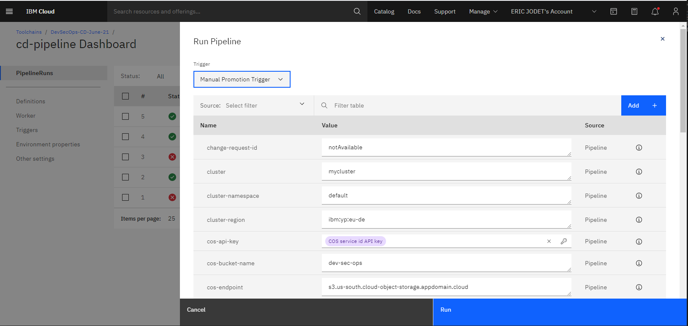
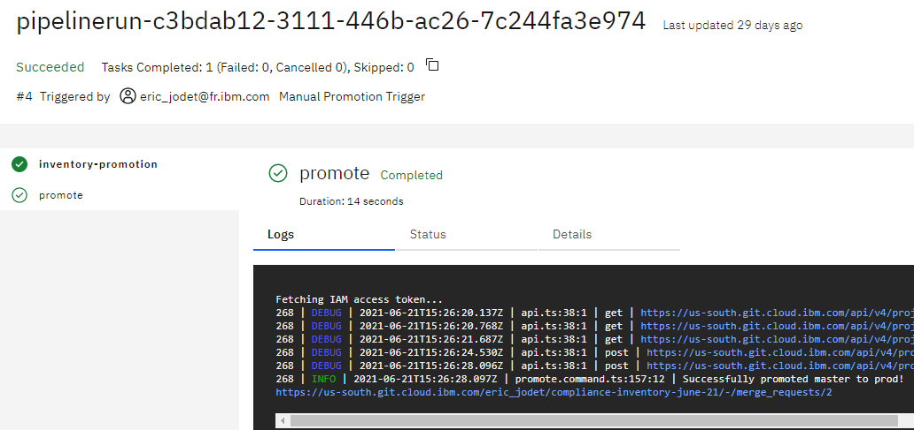

---

copyright:
  years: 2021
lastupdated: "2021-07-20"

keywords: DevSecOps

subcollection: ContinuousDelivery

---

{:shortdesc: .shortdesc}
{:table: .aria-labeledby="caption"}
{:external: target="_blank" .external}
{:codeblock: .codeblock}
{:pre: .pre}
{:screen: .screen}
{:tip: .tip}
{:note: .note}
{:important: .important}
{:download: .download}
{:help: data-hd-content-type='help'}
{:support: data-reuse='support'}

# Promoting inventory entries from source to target branches
{: #cd-devsecops-promote-branches}

The [DevSecOps reference implementation](/docs/ContinuousDelivery?topic=ContinuousDelivery-cd-devsecops-peer-review) helps to enforce the review of code changes before they are merged, promoted, and deployed to production.
{: shortdesc}

To promote code changes from the source (master) branch to the target (staging, prod) branch of your inventory repository (repo), complete the following steps:

1. The continuous integration pipelines populate the source (master) branch with [inventory entries](/docs/ContinuousDelivery?topic=ContinuousDelivery-cd-devsecops-change-mgmt). Use the continuous delivery promotion pipeline to promote this content from your source (master) branch to the target (staging or prod) branch.

* From the continuous delivery pipeline dashboard, click **Run Pipeline**. 
* Select **Manual Promotion Trigger**.
* Click **Run**. The pipeline-run creates a merge request to promote your code changes from the source branch to the target branch.

 

1. Approve and merge the pull request.

* Click the pipeline-run and check the execution log of the promotion pipeline.

 

* Locate the URL of the merge request and open the merge request.
* Populate the required fields (Priority, Change Request assignee, Additional Description, and other fields).
* Merge the merge request to promote your changes from the source branch to the target branch.

Now that your changes are promoted to the target branch, you can deploy them by using the [continuous delivery pipeline](/docs/ContinuousDelivery?topic=ContinuousDelivery-tutorial-cd-devsecops#devsecops-cd-toolchain-cd-pipeline-run).
